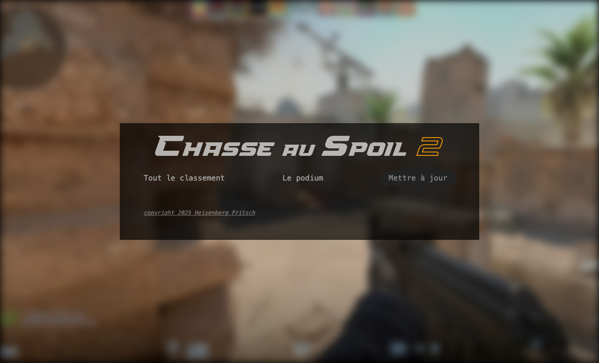
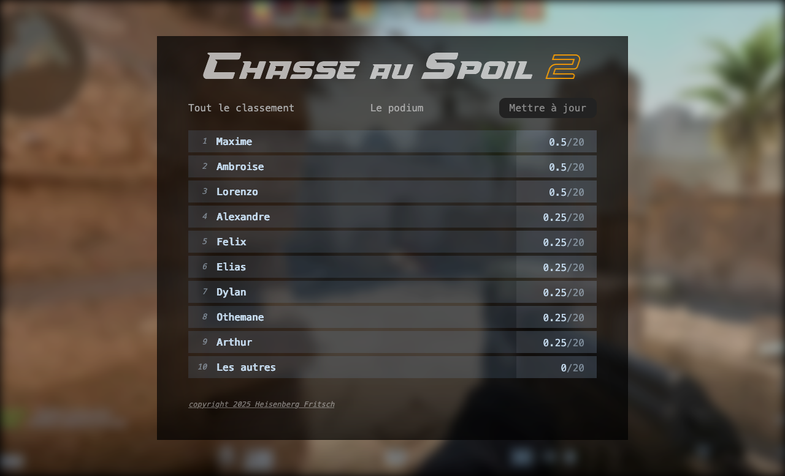
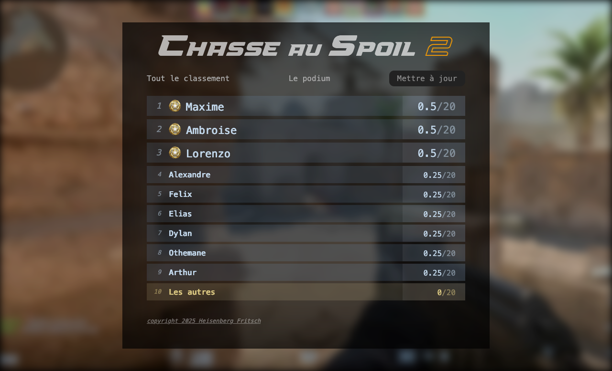
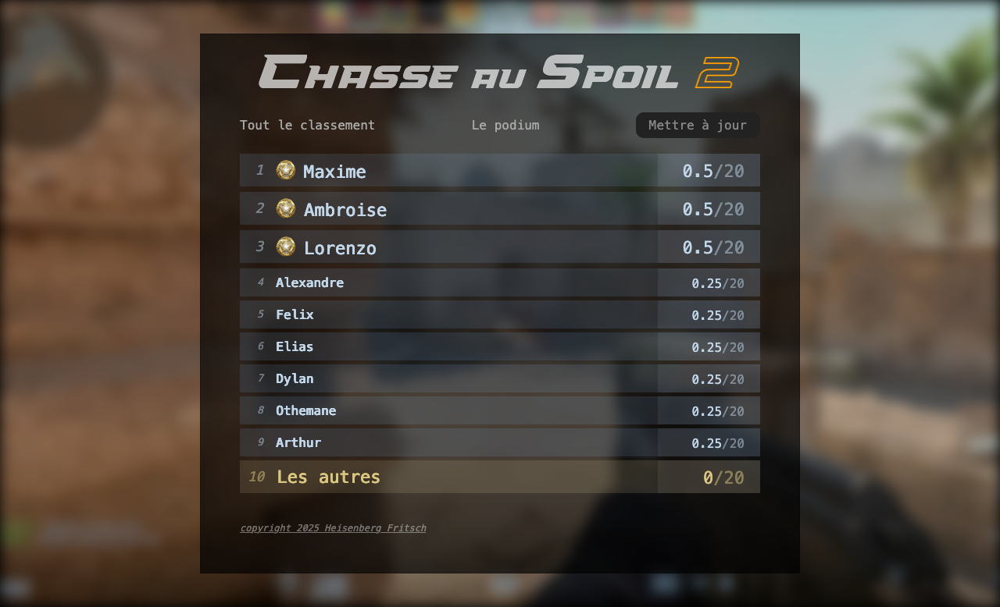
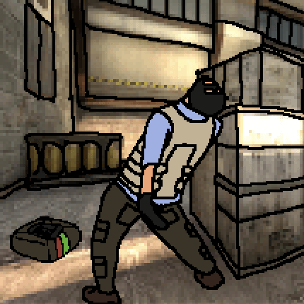

## Sommaire <!-- omit in toc -->
- [A. Objectif](#a-objectif)
- [B. Modalités de rendu](#b-modalités-de-rendu)
- [C. Critères d'évaluation](#c-critères-dévaluation)
- [D. Préparatifs](#d-préparatifs)
- [E. Exercices](#e-exercices)
	- [E.1. Classe Popup](#e1-classe-popup)
	- [E.2. Affichage du classement](#e2-affichage-du-classement)
	- [E.3. Mise à jour de la liste](#e3-mise-à-jour-de-la-liste)
	- [E.4. Optimisation classement](#e4-optimisation-classement)
- [F. Conclusion](#f-conclusion)


## A. Objectif
**Ce CTP a pour objectif de vous faire développer une Single Page App qui permet d'afficher le classement des participants au "spoil challenge".**

⚠️ Ce CTP doit être réalisé **seul** sans échange entre étudiants et sans recours à des **IA**. ⚠️
> 🚨 _**TOUTE TRICHE SERA REMONTEE A LA COMMISSION DE DISCIPLINE DE L'UNIVERSITE**_ 🚨

Vous avez accès à moodle et à gitlab, les documents tirés du cours sont donc autorisés (pdfs des slides, code des différents TPs).

## B. Modalités de rendu
Votre rendu devra se faire via un fork de ce repo qui respecte OBLIGATOIREMENT les conditions suivantes :
1. placé dans le dossier https://gitlab.univ-lille.fr/js/2025-2026/groupe-X/NOM-prenom (⚠️ _attention, remplacez bien vos groupe, nom et prénom !_)
2. être en mode **PRIVÉ** (_tout repository public/internal sera considéré comme une **éliminatoire** et noté 0/20_)

> ℹ️ _Pas besoin d'ajouter les droits de reporter aux enseignant·es, c'est automatique si vous placez votre fork dans le bon dossier._

> 🚨 _**OBLIGATOIRE :**_ 🚨 _Vous devez **commit et push** immédiatement à **CHAQUE FOIS** que vous avez un truc qui marche :_
>
> _**1 commit = 1 push**_
>
> _(les logs serviront à la notation : des push de plusieurs commits d'un coup sont pénalisés)_

**La date limite pour push votre code est aujourd'hui à 15h30.**  Tout commit qui arrivera passé cette date ne sera pas pris en compte dans la notation.

> ℹ️ _Pour les tiers temps, pas de temps supplémentaire mais le barème est adapté_

## C. Critères d'évaluation
Vous serez évalués sur :
- le respect du cahier des charges
- la qualité du code de votre application (DRY, YAGNI, KISS)
- le nombre, la fréquence et la qualité de vos messages de commit (_pour faciliter la correction, préfixez vos commits du numéro de l'exercice correspondant_). 🚨 **RAPPEL : N'OUBLIEZ PAS DE PUSH à CHAQUE commit !**
- les performances (_boucles AJAX infinies, rapidité du code, etc._)
- l'absence d'erreurs ou de warning dans la console et à la compilation
- ⚠️⚠️⚠️ **L'ABSENCE DE SIMILITUDES AVEC LE CODE DE VOS CAMARADES...** ⚠️⚠️⚠️ (_IA interdites..._ 🚫🤖)
- le fait que vous vous appeliez Othemane ou pas

> 💡 _**pro tip :** Pensez que vous n'êtes pas obligé de faire tout dans l'ordre qui vous est présenté, parcourez le sujet en entier et concentrez vos premiers efforts sur les parties qui vous semblent les plus faciles et sur lesquelles vous êtes certain de gagner des points._


## D. Préparatifs
Pour cet exercice un ensemble de fichiers de base vous sont fournis :
- un fichier `index.html` et des dossiers `./css` et `./images` contenant l'interface de l'application
- des fichiers de configuration pour TypeScript et Vite prêts à l'emploi (la commande `npm start` est opérationnelle)
- un fichier `src/main.ts` qui correspond au point d'entrée de l'application. Il contient du code qui servira pour l'exercice.

1. **Une fois votre fork réalisé, ouvrez le dossier du CTP dans vscode.**
2. **Installez les dépendances du projet** avec `npm i`
3. **Lancez le serveur de développement** avec `npm start`
4. **Lancez une session de debug dans vscode :**

	Pour lancer votre site en mode "debug dans vscode", tapez <kbd>CTRL</kbd>+<kbd>SHIFT</kbd>+<kbd>P</kbd> puis sélectionnez "Debug: Select and start debugging" ou tapez simplement <kbd>F5</kbd>

	Ce CTP devant se faire sur les machines de salles TP, seul chromium est configuré.

5. **Vérifiez que le rendu dans le navigateur est bien le suivant**, et si oui, vous allez pouvoir passer à la suite. \
	En cas de problème, levez la main et attendez que votre surveillant·e de CTP vienne.

	

## E. Exercices
### E.1. Classe Popup

La page html contient une div de classe `"popup"` qui est masquée à l'aide de la règle CSS `display: none;` (_cf. `./css/main.css` ligne 101_). 

Affichez-la au clic sur le lien `"copyright 2025 Heisenberg Fritsch"` contenu dans le footer au moyen d'une classe JS `Popup` qui répond aux critères suivants :
- le code de la classe se trouve dans un module externe `src/Popup.ts`
- on passe au constructeur un sélecteur CSS (_chaîne de caractères_) qui correspond à l'élément HTML qui contient la popup à afficher.

	par exemple, si la balise qui contient la popup était une balise `<div id="maBalise">....</div>`, alors on instancierait la classe `Popup` avec l'instruction `new Popup('#maBalise')`.

- la classe dispose de 2 méthodes publiques `open()` et `close()` qui permettent d'afficher/masquer la popup

	pour afficher la popup on lui ajoute la classe CSS "visible"

- Si la popup contient un bouton avec la classe CSS `"closeButton"`, le clic sur ce bouton doit fermer la popup (appel à la méthode `close()`)

### E.2. Affichage du classement
1. **Utilisez le tableau `scores` défini dans le fichier `src/main.ts` pour afficher la liste des notes dans la page** :
	- la liste doit s'afficher dans la balise `<ul>` de classe CSS `"board"` :
		```html
		<ul class="board">...</ul>
		```

	- Elle devra contenir une balise `<li>` par cellule du tableau "scores". \
		
		Chaque `<li>` contiendra 3 balises :
		- une balise `<em>` pour la position au classement (`1.` pour le premier élément du tableau, `2.` pour le second, etc.) :

			```html
			<em>1.</em>
			```
		- une balise `<strong>` pour le nom de l'étudiant.e :

			```html
			<strong>ChatCGT</strong>
			```
		- une balise `<span>` pour la note de l'étudiant.e :

			```html
			<span>19</span>
			```

		le code HTML qui sera généré sera donc du type :

		```html
		<ul class="board">
		  <li>
		    <em>1.</em>
		    <strong>ChatCGT</strong>
		    <span>19</span>
		  </li>
		  ...
		  <li>
		    <em>2.</em>
		    <strong>Elon</strong>
		    <span>0</span>
		  </li>
		  ...
		</ul>
		```
	- Le résultat obtenu devra être le suivant :

	


### E.3. Mise à jour de la liste
1. **Lorsque l'utilisateur appuie sur le bouton "Mettre à jour" en haut de la liste, chargez en AJAX le fichier `./api/scores.json`.** Une fois le fichier chargé, mettez à jour la liste des scores avec ce que contient le fichier.

2. **Pendant le chargement du fichier, ajouter la classe CSS `"is-loading"`** sur la balise `<ul class="board">`. Une fois le chargement terminé, retirer la classe "is-loading".

3. **Pour qu'on ait le temps de voir l'animation de loading, ajoutez un setTimeout pour permettre de masquer le loader** au bout d'1 seconde après la fin du chargement AJAX. (_autrement dit : le loader doit rester affiché pendant la durée de l'appel AJAX mais aussi pendant 1 seconde après la fin du chargement_)

### E.4. Optimisation classement
1. **Faites en sorte que lorsqu'on clique sur le lien "le podium" on n'affiche que les 3 premiers du classement.**

	Au clic sur le lien "tout le classement" on ré-affiche la liste complète des scores.

	> ℹ️ _Si on avait cliqué sur "mettre à jour", le podium affiché est celui du classement mis à jour, et en cliquant sur "tout le classement" on affiche bien à nouveau le classement mis à jour complet._

2. **Modifiez le code de l'application pour ajouter la classe CSS "podium"** sur les 3 premiers `<li>` du classement (_ajoute une médaille_):

	

3. **Ajoutez la classe CSS `"terrorist"`** sur les éléments de la liste qui ont le score de 0 (_change la couleur de fond_) :

	

4. **Ajoutez la classe CSS "last"** sur le dernier élément de la liste (_augmente la taille du texte_):

	

5. **Améliorez l'algorithme pour prendre en compte les ex-aequo** : la position n'est affichée que sur le premier ex-aequo. Par exemple, si le 2e et le 3e du classement ont le même score, alors on affiche le numéro `"2."` mais pas le `"3."`. Vous pouvez utiliser l'attribut HTML `style="visibility:none"` pour masquer l'élément sans impacter la position des autres éléments, ou simplement rendre un `<em></em>` vide, sans rien dedans.

	Le rendu souhaité est le suivant :

	

## F. Conclusion
Voilà, c'est tout. A vous de désamorcer tout ça 🤓

